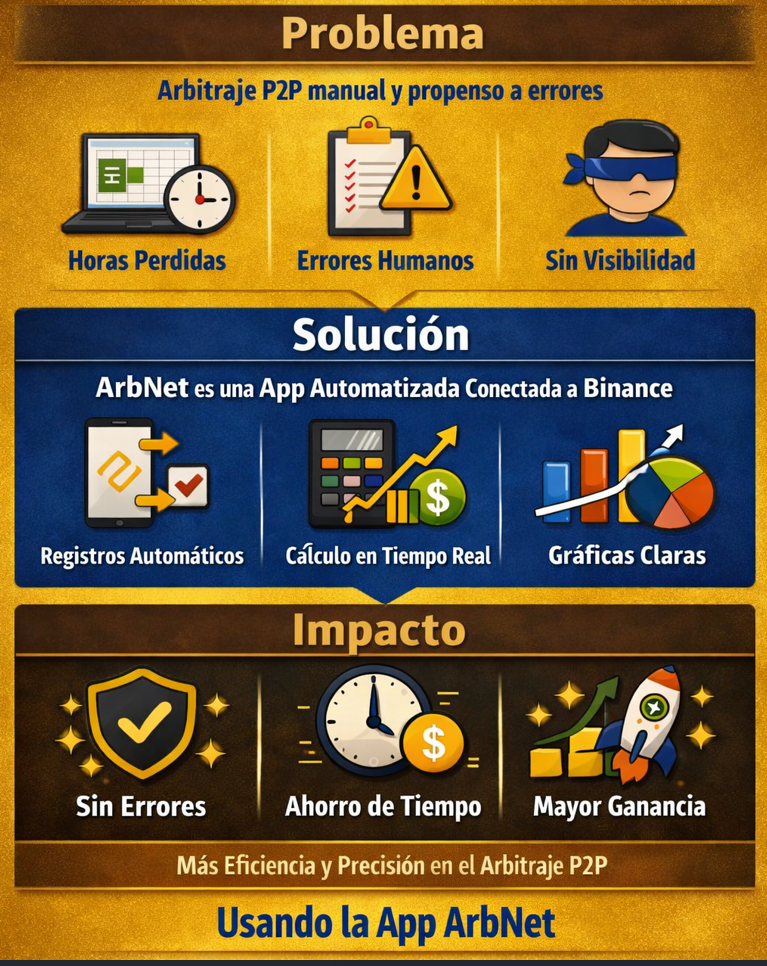
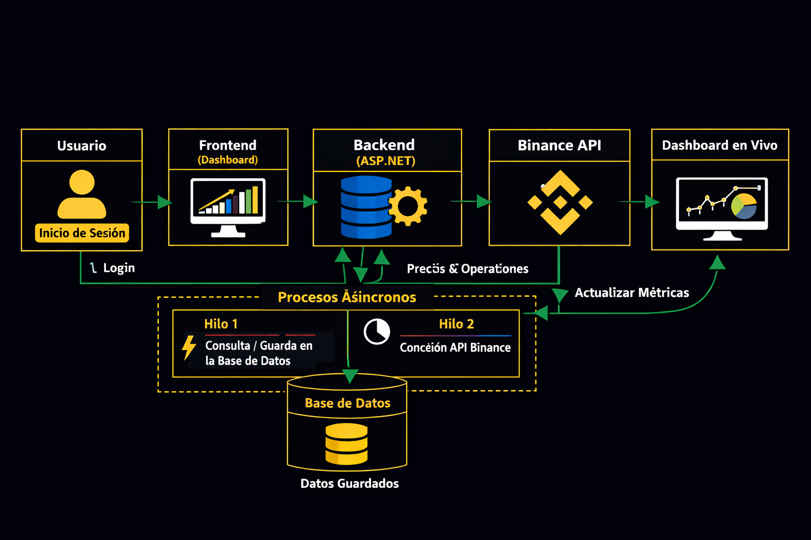
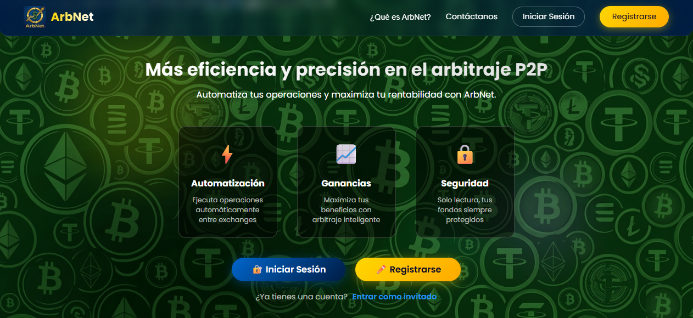

# ArbNet
“Versión demo del proyecto ArbNet para el GitHub Finish-Up-A-Thon Challenge.”

## Contenido Del README.
- <p><a href="#C0">Introduccion.</a></p>
- <p><a href="#C1">Requerimientos</a> → breve lista del MVP y funcionalidades.</p>
- <p><a href="#C2">Arquitectura</a> → diagrama simple del flujo (API Binance → Backend → DB → Frontend).</p>
- <p><a href="#C3">Pantallas</a> → mockups o capturas del Dashboard.</p>  
- <p><a href="#C4">Tecnologías</a> → frameworks y librerías usadas.</p> 
- <p><a href="#C5">Impacto</a> → cómo resuelve el problema de errores y tiempo perdido. </p> 
- <p><a href="#C6">Instrucciones de despliegue de ArbNet</a> → requisitos, pasos de instalación, variables de entorno.</p>  
- <p><a href="#C7">Demo</a> → capturas o video corto mostrando el flujo.</p>

---
<h2 id="C0">📌 Introducción</h2>

Este diagrama resume la propuesta de **ArbNet**, una aplicación automatizada conectada a **Binance** que optimiza el arbitraje P2P mediante procesos inteligentes y precisos.  

- En el modelo tradicional, cada comerciante P2P debe **registrar manualmente en una hoja de calculo(generalmente Excel) cada transacción realizada**, calcular ganancias o pérdidas con fórmulas y generar gráficas para analizar resultados. Este proceso repetitivo y propenso a errores consume tiempo y energía, afectando la eficiencia del negocio.  

- ArbNet transforma este flujo manual en un sistema **automatizado y confiable**, eliminando la necesidad de realizar la carga de las transaciones manualmente, ofreciendo cálculos en tiempo real, registros automáticos y reportes claros.  


<p align="center">
    
</p>
  
Nuestra App **ArbNet** se conecta con Binance, registra automáticamente cada operación y muestra ganancias y pérdidas en tiempo real, eliminando errores y ahorrando tiempo. Evitando con esto que los traders P2P pierden horas en una hoja de calculo y cometan errores que les cuestan dinero.

---
<h2 id="C1">Requerimientos</h2>
Los requerimientos básicos que la App ArbNet prentende cubrir son:

- Conectar con la API de Binance.
- Registrar operaciones de arbitraje.
- Mostrar métricas en un Dashboard.
- Evitar errores manuales en cálculos.

<h3>🧩 Producto Minimos Viable MVP</h3>
El MVP de la App ArbNet incluye las siguientes pantallas y funcionalidades básicas:

<ul>
  <li><strong>Pantalla de entrada</strong>
    <ul>
      <li>Logo + frase de impacto</li>
      <li>Botones: Iniciar sesión y Registrarse</li>
      <li>Opción secundaria: Entrar como invitado</li>
    </ul>
  </li>

  <li><strong>Pantalla de autenticación</strong>
    <ul>
      <li>Campos de usuario/contraseña</li>
      <li>Botón “Entrar”</li>
      <li>Enlace “¿Olvidaste tu contraseña?”</li>
    </ul>
  </li>

  <li><strong>Pantalla de registro</strong>
    <ul>
      <li>Campos básicos: nombre, correo, contraseña</li>
      <li>Botón “Crear cuenta”</li>
    </ul>
  </li>

  <li><strong>Dashboard principal</strong>
    <ul>
      <li>Capital total activo</li>
      <li>Ganancias Netas(Mes)</li>
      <li>Rendimiento(ROI)</li>
      <li>Gráfica de Rendimiento Semanal</li>
      <li>Métricas de transacciones Recientes</li>
    </ul>
  </li>
</ul>

---
<h2 id="C2">📌 Arquitectura Asincrónica y Multihilo</h2>
## 📌 Visión General
ArbNet implementa un modelo asincrónico para garantizar que el sistema no se bloque durante la comunicación con la **API de Binance**.  
El objetivo es mantener el **Frontend** activo y receptivo mientras el **Backend** procesa tareas en paralelo.

## 🔄 Flujo del sistema

1. **Usuario inicia sesión** en el **Frontend (Dashboard)**.  
2. El **Backend (ASP.NET)** valida credenciales y lanza procesos paralelos:  
   - **Hilo 1:** consulta y guarda datos en la **Base de datos**.  
   - **Hilo 2:** se comunica con la **API de Binance** para obtener precios y ejecutar operaciones.  
3. Ambos hilos funcionan de forma **asíncrona**, evitando bloqueos si uno se retrasa.  
4. Los resultados se almacenan en la **Base de datos**.  
5. El **Frontend** actualiza el **Dashboard en vivo** con métricas en tiempo real.

## 🧩 Beneficios
- Respuesta fluida ante peticiones del usuario.  
- Procesamiento paralelo de cálculos y sincronizaciones.  
- Recuperación automática ante fallos de conexión con Binance.  
- Escalabilidad para futuras tareas en segundo plano.

## 🖼️ Diagrama de flujo asincrónico



---
<h2 id="C3">📌 Pantallas principales de ArbNet.</h2>

ArbNet es responsivo y pensado para distintos dispositivos, y aqui se muestran la pantalla principal al iniciar la App
## Dashboard (Escritorio)


---
<h2 id="C4">📌 Tecnologías</h2>

ArbNet se construye con un stack moderno que asegura rendimiento, escalabilidad y facilidad de mantenimiento:

## 🖥️ Frontend
- Framework: React.js  
- Librerías: React Router, Fetch  
- Estilos: CSS3
- react-icons  

## ⚙️ Backend
- Framework: ASP.NET Core  
- Lenguaje: C#  
- API REST para comunicación con el frontend  
- Integración con Binance API  
- Api Swagger
- Swashbuckle Documentación

## 🗄️ Base de datos
- SQL Server para datos estructurados (usuarios, transacciones)  
- Entity Framework Core
- BCrypt.Net-Next  

## 🧩 Control de versiones
- GitHub para repositorio público  
- Ramas principales: `main`  

---
<h2 id="C5">📌 Impacto</h2>

ArbNet busca transformar el arbitraje P2P eliminando errores manuales y optimizando el tiempo de los usuarios.

## 🚩 Problemas actuales
- Horas perdidas en cálculos manuales.  
- Errores humanos al registrar operaciones.  
- Falta de métricas claras para tomar decisiones rápidas.  

## ✅ Solución con ArbNet
- Automatización del registro de órdenes P2P.  
- Dashboard en tiempo real con métricas clave (capital, ganancias, ranking de monedas).  
- Reducción de errores gracias a la integración con Binance API.  

## 📈 Beneficios para el usuario
- Ahorro de tiempo en cálculos y gestión de operaciones.  
- Mayor precisión en resultados financieros.  
- Decisiones más rápidas gracias a métricas claras y visuales.  
- Escalabilidad para futuras funciones como notificaciones y análisis predictivo.  

---
<h2 id="C6">📌 Instrucciones de despliegue de ArbNet</h2>

## 📁 Estructura del Proyecto

```text
ArbNet/
├── frontend/                     # Aplicación Frontend en React
│   ├── public/
│   │   └── images/               # Recursos gráficos estáticos
│   ├── src/
│   │   ├── components/           # Componentes reutilizables (Navbar, Modal, Footer)
│   │   ├── pages/
│   │   │   ├── auth/             # Vistas de autenticación (Welcome, Register)
│   │   │   └── Dashboard.jsx     # Panel de control principal
│   │   ├── App.jsx               # Enrutador y componente raíz
│   │   ├── index.jsx             # Punto de entrada de React
│   │   └── index.css             # Estilos globales
│   ├── package.json
│   └── vite.config.js            # Configuración del empaquetador Vite
│
├── backend/                      # API Backend en .NET 8
│   ├── ArbNet/
│   │   ├── Controllers/          # Endpoints de la API (Users, BinanceP2P)
│   │   ├── Models/               # Entidades de base de datos y DTOs
│   │   ├── Services/             # Lógica de negocio e integración con Binance
│   │   ├── DataContext/          # Conexión a datos (ArbNetDbContext.cs)
│   │   ├── appsettings.json      # Configuración local y credenciales
│   │   ├── Program.cs            # Inicialización de la API .NET
│   │   └── ArbNet.csproj
│   │
│   └── DataBase/
│       └── arbnet_setup.sql      # Script de inicialización de la Base de Datos
│
├── Documentation/
│   └── API_Documentation.md      # Manual de endpoints y contratos
├── License                       # Licencia del proyecto
└── README.md                     # Documentación principal de presentación
---
Instrucciones de Despliegue
## 🚀 Instrucciones de Despliegue

Sigue estos pasos para clonar, configurar y ejecutar **ArbNet** en tu entorno local.

### 📋 Requisitos Previos

Antes de comenzar, asegúrate de tener instalado el siguiente software en tu equipo:

| Software | Versión Mínima |
| :--- | :--- |
| **Node.js** | 18.x o superior |
| **.NET SDK** | 8.0 o superior |
| **SQL Server** | 2019 o superior (SSMS recomendado) |
| **Git** | 2.x o superior |

---

### ⚡ Pasos de Instalación y Configuración

#### 1. Clonar el Repositorio
Abre tu terminal y ejecuta los siguientes comandos para clonar el proyecto y acceder a la carpeta raíz:
```bash
git clone [https://github.com/eliezerpolidor/ArbNet.git](https://github.com/eliezerpolidor/ArbNet.git)
cd ArbNet

2. Configurar la Base de Datos
Abre SQL Server Management Studio (SSMS) y conéctate a tu instancia local.

Crea una base de datos vacía llamada arbnetDB:
CREATE DATABASE arbnetDB;
GO

Abre y ejecuta el script de inicialización ubicado en la ruta del proyecto:

backend/DataBase/arbnet_setup.sql

(Este script creará automáticamente las tablas OrdersP2P, Subscriptions, Transactions, Users, Wallets e insertará los datos iniciales).

3. Configurar y Levantar el Backend (.NET)
Navega a la carpeta del servidor, restaura los paquetes necesarios e inicia la API:
cd backend/ArbNet

# Restaurar paquetes NuGet
dotnet restore

# Ejecutar el servidor backend
dotnet run

Nota: Asegúrate de revisar el archivo appsettings.json para verificar que la cadena de conexión coincida con tus credenciales locales de SQL Server (ver sección de Variables de Entorno).

4. Configurar y Levantar el Frontend (React)
Abre una nueva terminal en la raíz del proyecto, navega a la carpeta de la interfaz e inicia el entorno de desarrollo:
cd frontend

# Instalar dependencias de Node
npm install

# Iniciar la aplicación React con Vite
npm run dev

🔑 Variables de Entorno y Configuración
Backend (appsettings.json)
Modifica el archivo ubicado en backend/ArbNet/appsettings.json con tu cadena de conexión local y tus llaves de prueba de Binance si es necesario:
{
  "ConnectionStrings": {
    "DefaultConnection": "Server=localhost;Database=arbnetDB;Trusted_Connection=True;TrustServerCertificate=True;"
  },
  "BinanceConfig": {
    "UseTestnet": true,
    "ApiKey": "TU_API_KEY_AQUI",
    "SecretKey": "TU_SECRET_KEY_AQUI"
  }
}

🏃 Ejecución de la AplicaciónUna vez configurado todo, el sistema se distribuye en los siguientes puertos locales:ComponenteComando de InicioURL / Puerto LocalBackend (API)dotnet runhttps://localhost:7039 o http://localhost:5115Frontend (App)npm run devhttp://localhost:5173Resumen rápido para iniciar el proyecto en el día a día:Asegúrate de que el servicio de SQL Server esté corriendo.Terminal 1 (Backend): cd backend/ArbNet && dotnet runTerminal 2 (Frontend): cd frontend && npm run devAbre tu navegador web e ingresa a: http://localhost:5173
---
