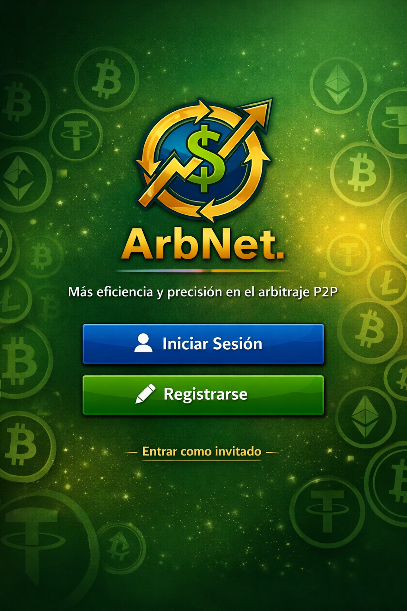

# ArbNet
“Versión demo del proyecto ArbNet para el GitHub Finish-Up-A-Thon Challenge.”

## Contenido Del README.
- 
<a href="#C0">Introduccion.</a>

- 
<a href="#C1">Requerimientos</a> → breve lista del MVP y funcionalidades.

- 
<a href="#C2">Arquitectura</a> → diagrama simple del flujo (API Binance → Backend → DB → Frontend).

- 
<a href="#C3">Pantallas</a> → mockups o capturas del Dashboard.
  
- 
<a href="#C4">Tecnologías</a> → frameworks y librerías usadas.
 
- 
<a href="#C5">Impacto</a> → cómo resuelve el problema de errores y tiempo perdido. 
 
- 
<a href="#C6">Instrucciones de despliegue de ArbNet</a> → requisitos, pasos de instalación, variables de entorno.
  
- 
<a href="#C7">Demo</a> → capturas o video corto mostrando el flujo.

---
<h2 id="C0">📌 Introducción</h2>

Este diagrama resume la propuesta de **ArbNet**, una aplicación automatizada conectada a **Binance** que optimiza el arbitraje P2P mediante procesos inteligentes y precisos.  

- En el modelo tradicional, cada comerciante P2P debe **registrar manualmente en una hoja de calculo(generalmente Excel) cada transacción realizada**, calcular ganancias o pérdidas con fórmulas y generar gráficas para analizar resultados. Este proceso repetitivo y propenso a errores consume tiempo y energía, afectando la eficiencia del negocio.  

- ArbNet transforma este flujo manual en un sistema **automatizado y confiable**, eliminando la necesidad de realizar la carga de las transaciones manualmente, ofreciendo cálculos en tiempo real, registros automáticos y reportes claros.  

    

  
Nuestra App **ArbNet** se conecta con Binance, registra automáticamente cada operación y muestra ganancias y pérdidas en tiempo real, eliminando errores y ahorrando tiempo. Evitando con esto que los traders P2P pierden horas en una hoja de calculo y cometan errores que les cuestan dinero.

---
<h2 id="C1">Requerimientos</h2>
Los requerimientos básicos que la App ArbNet prentende cubrir son:

- Conectar con la API de Binance.
- Registrar operaciones de arbitraje.
- Mostrar métricas en un Dashboard.
- Evitar errores manuales en cálculos.

<h3>🧩 Producto Minimos Viable MVP</h3>
El MVP de la App ArbNet incluye las siguientes pantallas y funcionalidades básicas:

<ul>
  <li><strong>Pantalla de entrada</strong>
    <ul>
      <li>Logo + frase de impacto</li>
      <li>Botones: Iniciar sesión y Registrarse</li>
      <li>Opción secundaria: Entrar como invitado</li>
    </ul>
  </li>

  <li><strong>Pantalla de autenticación</strong>
    <ul>
      <li>Campos de usuario/contraseña</li>
      <li>Botón “Entrar”</li>
      <li>Enlace “¿Olvidaste tu contraseña?”</li>
    </ul>
  </li>

  <li><strong>Pantalla de registro</strong>
    <ul>
      <li>Campos básicos: nombre, correo, contraseña</li>
      <li>Botón “Crear cuenta”</li>
    </ul>
  </li>

  <li><strong>Dashboard principal</strong>
    <ul>
      <li>Capital total activo</li>
      <li>Ganancias día/mes</li>
      <li>Estado del mercado P2P</li>
      <li>Ranking de monedas</li>
    </ul>
  </li>
</ul>

---
<h2 id="C2">📌 Arquitectura Asincrónica y Multihilo</h2>
## 📌 Visión General
ArbNet implementa un modelo asincrónico para garantizar que el sistema no se bloquee durante la comunicación con la **API de Binance**.  
El objetivo es mantener el **Frontend** activo y receptivo mientras el **Backend** procesa tareas en paralelo.

## 🔄 Flujo del sistema

1. **Usuario inicia sesión** en el **Frontend (Dashboard)**.  
2. El **Backend (ASP.NET)** valida credenciales y lanza procesos paralelos:  
   - **Hilo 1:** consulta y guarda datos en la **Base de datos**.  
   - **Hilo 2:** se comunica con la **API de Binance** para obtener precios y ejecutar operaciones.  
3. Ambos hilos funcionan de forma **asíncrona**, evitando bloqueos si uno se retrasa.  
4. Los resultados se almacenan en la **Base de datos**.  
5. El **Frontend** actualiza el **Dashboard en vivo** con métricas en tiempo real.

## 🧩 Beneficios
- Respuesta fluida ante peticiones del usuario.  
- Procesamiento paralelo de cálculos y sincronizaciones.  
- Recuperación automática ante fallos de conexión con Binance.  
- Escalabilidad para futuras tareas en segundo plano.

## 🖼️ Diagrama de flujo asincrónico

---
<h2 id="C3">📌 Pantallas principales de ArbNet.</h2>

ArbNet es responsivo y pensado para distintos dispositivos, y aqui se muestran las dos pantallas una para pc de escritorio y otra para móvil
## Dashboard (Escritorio)

Vista principal del sistema ArbNet en versión escritorio.
Muestra información de quienes somos, como contactarnos, para los que ya estan registrado 
inicio de sesión, para registrarse, en el centro del Dashboard una presentación de las 
funcionalidades de ArbNet. y abajo el pie de amigo donde sale nuestro copy right.

## Dashboard (Móvil)

Versión adaptada para dispositivos móviles.
muestra el logo con un menu de barras para activar las demas opciones, principalmente salen 
Iniciar sesión y registrarse y en el centro una breve presentación de las 
funcionalidades de ArbNet.

---
<h2 id="C4">📌 Tecnologías</h2>

ArbNet se construye con un stack moderno que asegura rendimiento, escalabilidad y facilidad de mantenimiento:

## 🖥️ Frontend
- Framework: React.js  
- Librerías: React Router, Axios  
- Estilos: CSS/Bootstrap para diseño responsivo  

## ⚙️ Backend
- Framework: ASP.NET Core  
- Lenguaje: C#  
- API REST para comunicación con el frontend  
- Integración con Binance API  

## 🗄️ Base de datos
- SQL Server para datos estructurados (usuarios, transacciones)  
- MongoDB opcional para almacenamiento flexible de logs  

## 🧩 Control de versiones
- GitHub para repositorio público  
- Ramas principales: `main` y `dev`  
- Issues y Projects para gestión de tareas  

## 🚀 Despliegue
- Frontend: Vercel / Netlify  
- Backend: Render / Railway  
- CI/CD para integración continua  

---
<h2 id="C5">📌 Impacto</h2>

ArbNet busca transformar el arbitraje P2P eliminando errores manuales y optimizando el tiempo de los usuarios.

## 🚩 Problemas actuales
- Horas perdidas en cálculos manuales.  
- Errores humanos al registrar operaciones.  
- Falta de métricas claras para tomar decisiones rápidas.  

## ✅ Solución con ArbNet
- Automatización del registro de órdenes P2P.  
- Dashboard en tiempo real con métricas clave (capital, ganancias, ranking de monedas).  
- Reducción de errores gracias a la integración con Binance API.  

## 📈 Beneficios para el usuario
- Ahorro de tiempo en cálculos y gestión de operaciones.  
- Mayor precisión en resultados financieros.  
- Decisiones más rápidas gracias a métricas claras y visuales.  
- Escalabilidad para futuras funciones como notificaciones y análisis predictivo.  

---
<h2 id="C6">📌 Instrucciones de despliegue de ArbNet</h2>
<h2 id="C7">📌 Demo</h2>